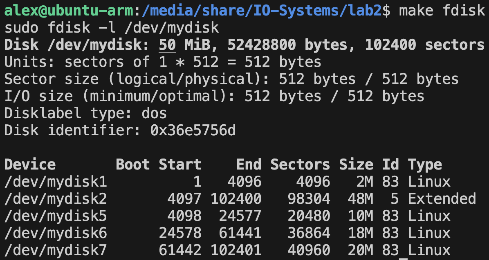
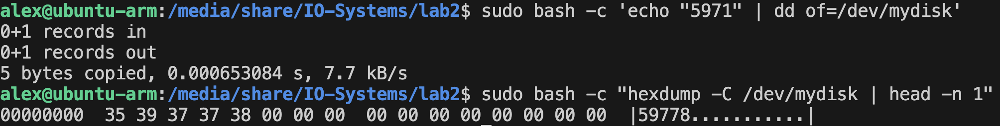
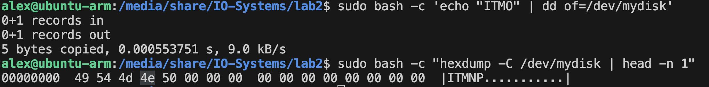

# Лабораторная работа 2

**Название:** "Разработка драйверов блочных устройств"

**Цель работы:** получить знания и навыки разработки драйверов блочных устройств для операционной системы Linux.

**Вариант** 10

## Задачи

- Написать драйвер блочного устройства, удовлетворяющий
требованиям:
    - Драйвер должен создавать виртуальный жесткий диск в оперативной памяти с размером 50 Мбайт.
    - Созданный диск должен быть разбит на разделы в соответствии с вариантом задания.
    - Измерить скорость передачи данных при копировании файлов между разделами созданного виртуального диска.
    - Измерить скорость передачи данных при копировании файлов между разделами виртуального и реального жестких дисков.

## Описание функциональности драйвера

Один первичный раздел размером 2Мбайт и один расширенный раздел, содержащий три логических раздела размером 10Мбайт, 18Мбайт и 20Мбайт.

Каждый записываемый байт должен быть арифметическим средним от трех предыдущих.

## Инструкция по сборке

Требуемая версия ядра: 4.15

Выполнить

```bash
make
```

Чтобы избавиться от артефактов сборки, выполнить

```bash
make clean
```

## Инструкция пользователя

для загрузки модуля выполнить

```bash
make install
```

для выгрузки модуля

```bash
make remove
```

## Примеры использования

Выполнить команду `sudo fdisk -l /dev/mydisk` или `make fdisk`

Ожидаемый результат:


## Проверка на соответствие второй части задания

```bash
sudo bash -c 'echo "567" | dd of=/dev/mydisk'
```


```bash
sudo bash -c 'echo "5971" | dd of=/dev/mydisk'
```



```bash
sudo bash -c 'echo "ITMO" | dd of=/dev/mydisk'
```



## Измерение скорости передачи данных между дисками

```bash
root@ubuntu-arm:/media/share/IO-Systems/lab2# ./bench.sh 
Creating filesystems...
mkfs.fat 4.1 (2017-01-24)
mkfs.vfat: unable to open /dev/mydisk1: No such file or directory
Creating directories...
Mounting filesystems...
mount: /mnt/disk1: special device /dev/mydisk1 does not exist.
5+0 records in
5+0 records out
5242880 bytes (5.2 MB, 5.0 MiB) copied, 0.0175133 s, 299 MB/s
5+0 records in
5+0 records out
5242880 bytes (5.2 MB, 5.0 MiB) copied, 0.0139267 s, 376 MB/s
5+0 records in
5+0 records out
5242880 bytes (5.2 MB, 5.0 MiB) copied, 0.0117541 s, 446 MB/s
5+0 records in
5+0 records out
5242880 bytes (5.2 MB, 5.0 MiB) copied, 0.0116686 s, 449 MB/s
Copying files from virtual to virtual...
5.00MiB 0:00:00 [2.37GiB/s] [==================================================================================>] 100%
5.00MiB 0:00:00 [2.50GiB/s] [==================================================================================>] 100%
5.00MiB 0:00:00 [2.91GiB/s] [==================================================================================>] 100%
5.00MiB 0:00:00 [2.94GiB/s] [==================================================================================>] 100% 
5+0 records in
5+0 records out
5242880 bytes (5.2 MB, 5.0 MiB) copied, 0.011624 s, 451 MB/s
5+0 records in
5+0 records out
5242880 bytes (5.2 MB, 5.0 MiB) copied, 0.010794 s, 486 MB/s
5+0 records in
5+0 records out
5242880 bytes (5.2 MB, 5.0 MiB) copied, 0.0112189 s, 467 MB/s
5+0 records in
5+0 records out
5242880 bytes (5.2 MB, 5.0 MiB) copied, 0.0108894 s, 481 MB/s
Copying files from virtual to real...
5.00MiB 0:00:00 [21.8MiB/s] [==================================================================================>] 100%
5.00MiB 0:00:00 [22.1MiB/s] [==================================================================================>] 100%
5.00MiB 0:00:00 [22.5MiB/s] [==================================================================================>] 100%
5.00MiB 0:00:00 [21.4MiB/s] [==================================================================================>] 100%
5+0 records in
5+0 records out
5242880 bytes (5.2 MB, 5.0 MiB) copied, 0.0108914 s, 481 MB/s
5+0 records in
5+0 records out
5242880 bytes (5.2 MB, 5.0 MiB) copied, 0.0117443 s, 446 MB/s
5+0 records in
5+0 records out
5242880 bytes (5.2 MB, 5.0 MiB) copied, 0.0104057 s, 504 MB/s
5+0 records in
5+0 records out
5242880 bytes (5.2 MB, 5.0 MiB) copied, 0.0107257 s, 489 MB/s
Copying files from real to virtual...
5.00MiB 0:00:00 [33.0MiB/s] [==================================================================================>] 100% 
5.00MiB 0:00:00 [33.0MiB/s] [==================================================================================>] 100%
5.00MiB 0:00:00 [33.2MiB/s] [==================================================================================>] 100%
5.00MiB 0:00:00 [33.0MiB/s] [==================================================================================>] 100%
Unmounting filesystems...
umount: /dev/mydisk1: no mount point specified.
Deleting directories...
```
